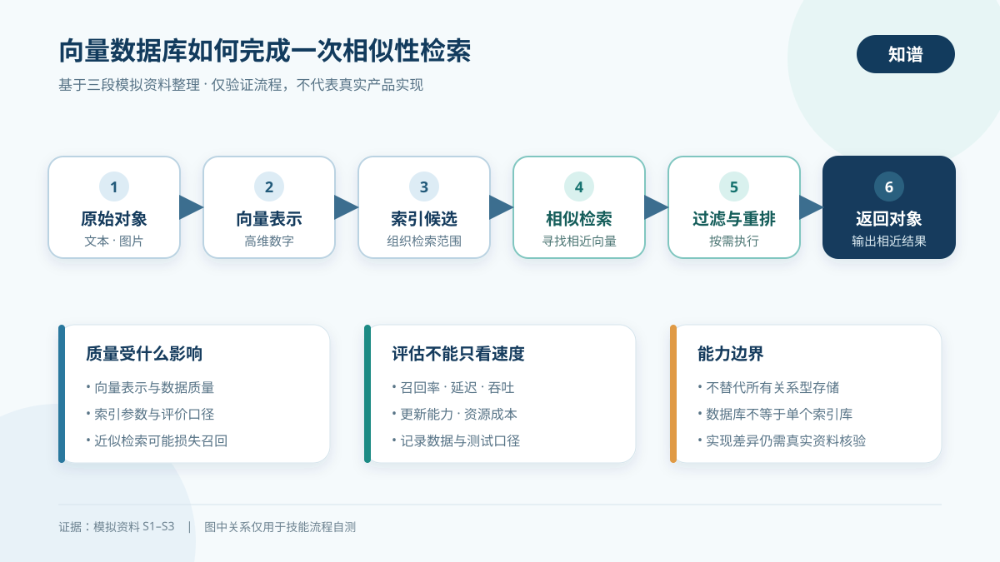

# 知谱科技概念研学助手：向量数据库最小自测

> 测试性质：以下三段材料是为验证技能流程而编写的模拟资料，不是真实出版物，也不能证明内容在现实世界中正确。本文只验证多源整理、证据标注、图文讲解和诚实降级能力；正式参赛演示应替换为可公开核验的真实来源。

## 测试输入

- 目标概念：向量数据库。
- 用户水平：初学者。
- 用户指令：帮我从零搞懂向量数据库，输出文字加图的学习文档。
- 材料范围：三段相互独立提供的模拟资料，不进行网络检索。

## 模拟资料

- **S1**：向量数据库用于存储、索引和检索高维向量。文本、图片等对象可先转换为向量，再按余弦相似度、内积或欧氏距离寻找相近对象。近似最近邻检索用较低查询成本换取可能的召回损失。
- **S2**：典型查询链路是“对象转向量—索引候选检索—可选元数据过滤—可选结果重排—返回对象”。完整的向量数据库通常还提供持久化、增删改、元数据管理和访问控制，能力边界不同于只负责搜索的向量索引库。
- **S3**：向量数据库不能替代所有关系型数据存储；检索质量依赖向量表示、数据质量、索引参数和评价口径。评估时应同时观察召回率、延迟、吞吐、更新能力与资源成本。

## 三分钟先懂

### 一句话定义

在本次模拟资料的共同表述中，向量数据库是一类围绕高维向量的存储、索引和相似性检索组织能力，并可配合元数据管理、更新和过滤等功能的系统。[S1][S2]

### 它解决什么问题

当文本、图片等对象被转换为一组数字后，可以用距离或相似度寻找“数值表示上接近”的对象。[S1] 这使系统不必只依靠字面完全一致的关键词来发现相关内容。后一表述是基于模拟材料的教学推导，并非已由真实来源核验的事实。

### 三个关键点

1. **先表示，再检索**：对象需要先转换成向量，然后才能进入相似性查询链路。[S1][S2]
2. **速度与召回可能存在取舍**：近似检索降低查询成本时，可能漏掉部分本应返回的结果。[S1]
3. **数据库不等于单个索引算法**：完整系统还可能承担持久化、更新、元数据和访问控制等职责。[S2]

## 前置知识

- **向量**：可把它理解为一组按顺序排列的数字；本次模拟材料没有给出严格数学定义，正式报告需要补充权威数学来源。
- **相似度或距离**：衡量两个向量接近程度的方法。S1列出余弦相似度、内积和欧氏距离，但未解释它们的适用条件。
- **召回率**：用于观察目标结果中有多少被成功找回；该解释是便于理解的简化说法，正式报告应补充评价定义来源。

## 工作原理

依据S2，可将最小查询流程整理为：对象转向量，进入索引搜索得到候选结果，按需进行元数据过滤与结果重排，最后返回相近对象。S1补充了相似性计算和近似检索的取舍，S3则提示质量还会受到数据、索引参数和评价口径影响。

图中从左到右展示模拟资料支持的查询主链路；下方三张卡片分别说明质量影响因素、评估维度和能力边界。箭头只表达步骤顺序，不代表所有产品都必须采用完全相同的内部实现。

## 一个简化例子

假设用户输入一段产品问题，系统先把这段文字转换为向量，再从索引中找出相近候选，按产品类别过滤，并对候选重新排序后返回相关资料。这个例子用于解释S2中的流程，具体向量生成方式、索引结构和排序方法在模拟资料中均未给出，因此不得据此推断真实产品实现。

## 相邻概念对比

| 概念 | 本次模拟资料支持的差异 | 证据状态 |
| --- | --- | --- |
| 向量数据库 | 可能包含持久化、增删改、元数据管理、访问控制与检索能力 | S2单一模拟来源支持，待真实核验 |
| 向量索引库 | S2将其描述为更聚焦搜索能力，但没有给出严格边界 | 定义不完整，待真实核验 |
| 关系型数据存储 | S3仅说明向量数据库不能替代所有关系型存储，未提供详细比较 | 只能确认边界提醒，不能扩写 |

## 常见误区与边界

1. **误区：有了向量数据库就不再需要其他数据库。** S3明确反对这一绝对化结论。[S3]
2. **误区：检索速度快就代表效果一定好。** S1提示近似检索可能损失召回，S3要求同时观察多项指标。[S1][S3]
3. **误区：换一个索引参数不会影响结果。** S3把索引参数列为质量影响因素之一。[S3]
4. **尚不能回答的问题**：如何选择距离函数、不同索引结构怎样工作、数据怎样转换成高质量向量，以及各种实现的性能差异。模拟资料不足以回答这些问题。

## 学习路线

1. **入门**：理解向量、距离、相似度和最近邻问题。
2. **机制**：学习对象如何转成向量，以及精确检索和近似检索的区别。
3. **系统**：理解索引、持久化、更新、过滤、重排和访问控制如何协同。
4. **评估**：同时观察召回率、延迟、吞吐、更新能力和资源成本。[S3]
5. **实践**：用一组可公开复现的数据比较不同参数，并记录数据、指标和测试环境。

以上路线根据三段模拟资料组织，其中前两步包含待真实来源补证的前置知识，不应视为已完成事实核验。

## 关键结论与证据对照

| 编号 | 关键结论 | 支持材料 | 信息性质 | 置信程度 |
| --- | --- | --- | --- | --- |
| C1 | 系统围绕高维向量的存储、索引和检索工作 | S1、S2 | 模拟资料事实 | 低：没有真实来源 |
| C2 | 近似最近邻检索可能以召回损失换取较低查询成本 | S1 | 模拟资料事实 | 低：单一模拟来源 |
| C3 | 查询链路可包含过滤与重排 | S2 | 模拟资料事实 | 低：单一模拟来源 |
| C4 | 不应把向量数据库视为所有关系型存储的替代品 | S3 | 模拟资料边界 | 低：单一模拟来源 |
| C5 | 评估应同时考虑质量、性能、更新和成本 | S3 | 模拟资料建议 | 低：单一模拟来源 |

## 来源索引与限制

- S1、S2、S3均为本次自测临时编写的模拟资料，没有作者、发布主体、日期、版本、页码或公开地址。
- 三段文字虽然分别提供，但无法证明发布主体独立，因此不满足正式报告的“三个独立可信来源”验收条件。
- 本次输出不得用于学习成果发布或技术选型；后续应替换成至少三个可公开核验的真实来源。

## 自测验收结果

| 验收项 | 结果 | 说明 |
| --- | --- | --- |
| 输入概念与多段资料解析 | 通过 | 正确识别一个概念与三段模拟资料 |
| 关键结论可反查 | 通过 | 使用S1至S3逐项定位 |
| 事实、推导和缺口分离 | 通过 | 未把教学推导写成已核验事实 |
| 来源真实性与独立性 | 降级通过 | 明确说明模拟资料不是真实独立来源 |
| 图文文档 | 通过 | 生成一张宽屏本地矢量图并附解释 |
| 图解安全 | 通过 | 无外部字体、图片、脚本、动画或网络资源 |
| 不编造真实来源 | 通过 | 未生成虚假作者、链接、日期或页码 |

## 测试结论

技能能够在资料不满足正式证据要求时诚实降级，同时产出结构完整的最小图文研学文档。现有 `SKILL.md`（技能说明文件）已经覆盖来源独立性、模拟或低质量资料降级、图解安全和证据缺口，因此本次测试后不需要修改。后续应以真实科技概念资料替换模拟样例，验证在线检索、页面定位和来源矛盾消解能力。
